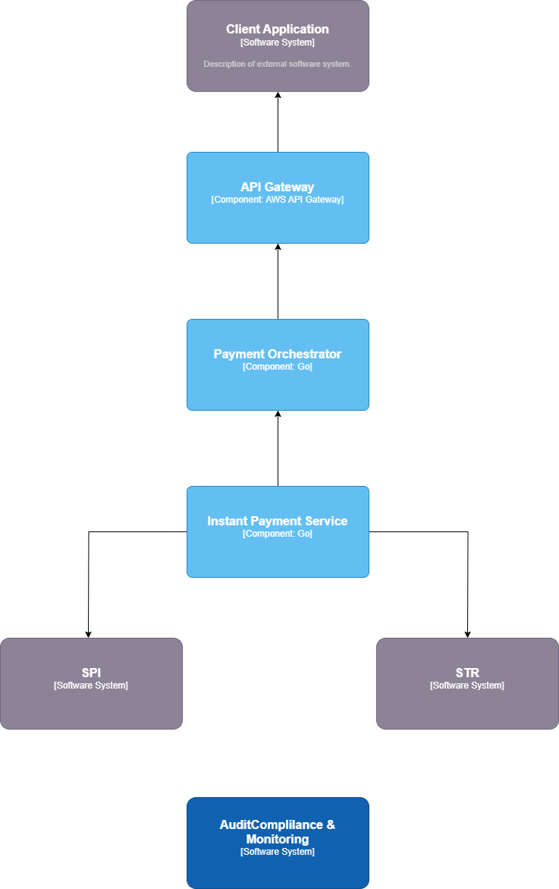

# Plataforma de Integração com RSFN – SPI e STR

Este repositório descreve a arquitetura de uma plataforma de integração com a **Rede do Sistema Financeiro Nacional (RSFN)**, conectando-se especificamente aos sistemas **SPI (Sistema de Pagamentos Instantâneos)** e **STR (Sistema de Transferência de Reservas)**. A solução é orientada por princípios da **BIAN (Banking Industry Architecture Network)**, garantindo modularidade, interoperabilidade e reutilização de componentes.

---

## Visão Geral

A plataforma provê uma camada de abstração via APIs para aplicativos clientes, orquestrando a comunicação com os sistemas financeiros nacionais por meio de serviços especializados. Cada serviço foi desenhado com base em domínios funcionais definidos pelo BIAN, assegurando alinhamento às melhores práticas de arquitetura bancária.

---

## Componentes da Solução

### 1. `InstantPaymentService`

- **Responsabilidade**: Integração com o SPI para envio, recebimento e reconciliação de transações via PIX.
- **Domínios BIAN aplicados**:
  - `Payment Execution`
  - `Clearing Settlement`
- **Capacidades envolvidas**:
  - Gerenciamento de transações instantâneas
  - Validação de mensagens conforme especificações do Banco Central
  - Assinatura digital e autenticação mútua (MTLS)

---

### 2. `ReserveTransferService`

- **Responsabilidade**: Comunicação com o STR para transferência de reservas entre instituições.
- **Domínios BIAN aplicados**:
  - `Funds Transfer Operations`
  - `Correspondent Bank Operations`
- **Capacidades envolvidas**:
  - Execução de transferências prioritárias e agendadas
  - Conversão de protocolos (ex.: ISO 20022)
  - Monitoramento de liquidação

---

### 3. `API Gateway Service`

- **Responsabilidade**: Exposição de APIs RESTful para os aplicativos cliente.
- **Domínios BIAN aplicados**:
  - `Service Gateway`
  - `Channel Activity History`
- **Capacidades envolvidas**:
  - Autenticação (OAuth2/OpenID Connect)
  - Rate limiting e logging
  - Encaminhamento de chamadas por contexto

---

### 4. `PaymentOrchestratorService`

- **Responsabilidade**: Composição de operações entre SPI e STR, enriquecimento e fallback de pagamentos.
- **Domínio BIAN aplicado**:
  - `Business Orchestration`
- **Capacidades envolvidas**:
  - Coordenação de serviços de pagamento
  - Definição de políticas de fallback
  - Execução transacional distribuída

---

### 5. `AuditComplianceService`

- **Responsabilidade**: Registro de eventos e auditoria de conformidade.
- **Domínios BIAN aplicados**:
  - `Compliance Reporting`
  - `Operational Event History`
- **Capacidades envolvidas**:
  - Geração de trilhas de auditoria
  - Hashing de logs
  - Integração com sistemas de compliance

---

### 6. `MonitoringService`

- **Responsabilidade**: Observabilidade e telemetria dos serviços da plataforma.
- **Domínios BIAN aplicados**:
  - `IT Operations`
  - `Performance Analysis`
- **Capacidades envolvidas**:
  - Coleta de métricas
  - Tracing distribuído
  - Alertas e dashboards

---

## Diagrama de Arquitetura

